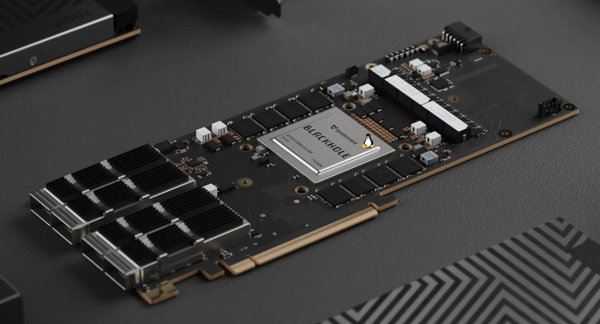

# Tenstorrent Blackhole P100/P150 Linux demo

This is a demo of Linux runnning on the [Tenstorrent Blackhole P100/P150](https://tenstorrent.com/hardware/blackhole) PCIe card using the onboard [SiFive x280](https://www.sifive.com/cores/intelligence-x200-series) RISC-V cores.


(*Note: This is **not** a Tenstorrent designed CPU such as the high performance [Ascalon](https://tenstorrent.com/en/ip/tt-ascalon) core*)

This demo downloads OpenSBI, Linux and userspace images, configures them on the Blackhole hardware and starts the x280 cores to boot them.

## Hardware details
Blackhole has 4 clusters of 4 x280 RISC-V cores called an L2CPU (ie. 16 cores total). Each L2CPU can run as a single coherent SMP. Separate L2CPUs aren't coherent.
```
┌───────────────────────────────────────────────────────────────────────┐
│                                                                       │
│                                                            BLACKHOLE  │
│                                                                       │
│    ┌────────┐ ┌────────┐ ┌────────┐ ┌────────┐┌────────┐ ┌────────┐   │
│    │ TENSIX │ │ TENSIX │ │ TENSIX │ │ TENSIX ││ TENSIX │ │ TENSIX │   │
│    └────────┘ └────────┘ └────────┘ └────────┘└────────┘ └────────┘   │
│      ............................................................     │
│    ┌────────┐ ┌────────┐ ┌────────┐ ┌────────┐┌────────┐ ┌────────┐   │
│    │ TENSIX │ │ TENSIX │ │ TENSIX │ │ TENSIX ││ TENSIX │ │ TENSIX │   │
│    └────────┘ └────────┘ └────────┘ └────────┘└────────┘ └────────┘   │
│    ┌────────┐ ┌────────┐ ┌────────┐ ┌────────┐┌────────┐ ┌────────┐   │
│    │ TENSIX │ │ TENSIX │ │ TENSIX │ │ TENSIX ││ TENSIX │ │ TENSIX │   │
│    └────────┘ └────────┘ └────────┘ └────────┘└────────┘ └────────┘   │
│   ┌─────────────┐  ┌─────────────┐  ┌─────────────┐  ┌─────────────┐  │
│   │ ┌──────┐    │  │ ┌──────┐    │  │ ┌──────┐    │  │ ┌──────┐    │  │
│   │ │┌─────┴┐   │  │ │┌─────┴┐   │  │ │┌─────┴┐   │  │ │┌─────┴┐   │  │
│   │ ││┌─────┴┐  │  │ ││┌─────┴┐  │  │ ││┌─────┴┐  │  │ ││┌─────┴┐  │  │
│   │ │││┌─────┴┐ │  │ │││┌─────┴┐ │  │ │││┌─────┴┐ │  │ │││┌─────┴┐ │  │
│   │ └┤││      │ │  │ └┤││      │ │  │ └┤││      │ │  │ └┤││      │ │  │
│   │  └┤│ x280 │ │  │  └┤│ x280 │ │  │  └┤│ x280 │ │  │  └┤│ x280 │ │  │
│   │   └┤      │ │  │   └┤      │ │  │   └┤      │ │  │   └┤      │ │  │
│   │    └──────┘ │  │    └──────┘ │  │    └──────┘ │  │    └──────┘ │  │
│   │       L2CPU │  │       L2CPU │  │       L2CPU │  │       L2CPU │  │
│   └──────┬──────┘  └──────┬──────┘  └──────┬──────┘  └──────┬──────┘  │
│          │                │                └────────┬───────┘         │
└──────────┼────────────────┼─────────────────────────┼─────────────────┘
       ┌───┴───┐        ┌───┴───┐                 ┌───┴───┐
       │       │        │       │                 │       │
       │  4GB  │        │  4GB  │                 │  4GB  │
       │ DRAM  │        │ DRAM  │                 │ DRAM  │
       │       │        │       │                 │       │
       └───────┘        └───────┘                 └───────┘
```
The first two L2CPUs each have 4GB of DRAM attached. The last two share 4GB of DRAM.
*(Note: This is a simplied diagram. Using the memory remapping (via NoC TLBs) all L2CPUs can access all DRAMs. Doing this is much slower and potentially non-coherent)*

Blackhole also has 120 Tensix cores (not Linux capable). P100 has an addtional 16GB of attached DRAM and P150 has an additional 20GB of attached DRAM (ie. 28/32GB for total for P100/P150 respectfully). These additional resources aren't use for this demo.

This demo *cannot* be used concurrently with the [Tenstorrent AI stack](https://github.com/tenstorrent/tt-metal).

## Boot Linux

### Dependencies

The demo uses the same interfaces as the Tenstorrent System Management
Interface (TT-SMI) tool to interact with the Blackhole PCIe device:

 * [luwen](https://github.com/tenstorrent/luwen/), a Rust library with a Python
   interface for programming Tenstorrent hardware
 * [tt-kmd](https://github.com/tenstorrent/tt-kmd/), a Linux kernel module that
   provides an interface for userspace such as luwen

The 'just' script can be used to set up tt-smi and tt-kmd automatically.

### Install just

Install the `just` package if you're running Ubuntu 24.04 or newer:
```
sudo apt install just
```

If you're running something older, run the following script to grab a release
from the just github page:
```
./get_just.sh 
```

### Install dependencies
```
just install_all
```

### Build Linux, OpenSBI and the host tool
```
just build_all
```

### Boot Linux
```
just boot
```
This will launch a console application.  Default login is `root`/`root`x.  Quit with `Ctrl-A`.

[More information is available here](INFO.md)

### Manual installation

If you prefer to manually install tt-smi, first install the dependencies:
```
sudo apt install -y python3-venv cargo rustc
```

Then install tt-smi using pipx:
```
pipx install https://github.com/tenstorrent/tt-smi
```
luwen is installed as a dependency of of tt-smi.

The kernel module can bee installed by following the instructions on the
[tt-kmd](https://github.com/tenstorrent/tt-kmd/) repository.
